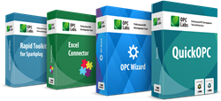

This directory contains examples for OPC client and subscriber development in PowerShell. The examples cover OPC Data Access
(OPC DA), OPC Alarms&Events (OPC A&E), OPC XML, and OPC Unified Architecture (OPC UA) specifications, including OPC UA 
PubSub. They are supported on Microsoft Windows.

The examples work with our sample servers and publishers. Most of them reside on the Web; OPC "Classic" servers for Windows
are installed using the [Connectivity Software Setup program](https://www.opclabs.com/download).

Useful links:
* **[OPC Labs home page](https://www.opclabs.com)**
* [OPC Labs Knowledge Base](https://kb.opclabs.com)
* [Connectivity Software Setup program](https://www.opclabs.com/download)
* [Examples in PowerShell on GitHub](https://github.com/OPCLabs/Examples-ConnectivityStudio-PowerShell).
*
* [Getting Started with QuickOPC](https://opclabs.doc-that.com/files/onlinedocs/OPCLabs-ConnectivityStudio/Latest/User%27s%20Guide%20and%20Reference-Connectivity%20Software/webframe.html#Getting%20Started%20with%20QuickOPC.html).
* [QuickOPC Examples in the documentation](https://opclabs.doc-that.com/files/onlinedocs/OPCLabs-ConnectivityStudio/Latest/User%27s%20Guide%20and%20Reference-Connectivity%20Software/webframe.html#QuickOPC%20Examples.html).
* 
* [Getting Started with OPC Wizard under .NET Framework or .NET](https://opclabs.doc-that.com/files/onlinedocs/OPCLabs-ConnectivityStudio/Latest/User%27s%20Guide%20and%20Reference-Connectivity%20Software/webframe.html#Getting%20Started%20with%20OPC%20Wizard%20under%20.NET%20Framework%20or%20.NET.html).
* [OPC Wizard Examples in the documentation](https://opclabs.doc-that.com/files/onlinedocs/OPCLabs-ConnectivityStudio/Latest/User%27s%20Guide%20and%20Reference-Connectivity%20Software/webframe.html#OPC%20Wizard%20Examples.html).

Need help, or missing some example? Ask us for it on our [Online Forums](https://forum.opclabs.com/forum/index)!
You do not have to own a commercial license in order to use Online Forums, 
and we reply to every post.
